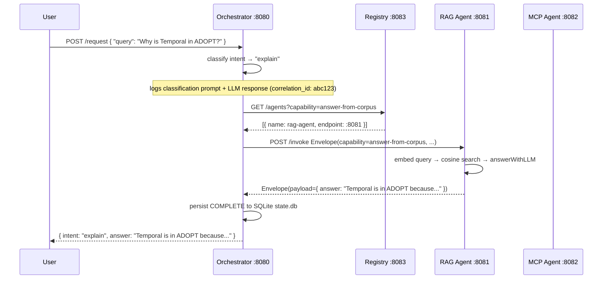

# Exercise C — A2A Tech Radar Concierge

Four independent processes on localhost, wired together via a shared message envelope and a capability registry.

---

## What it does

A user sends a natural-language query to the **Orchestrator**. The orchestrator classifies the intent (explain vs change), queries the **Registry** for the right agent, and dispatches the request. The **RAG Agent** answers *why* questions from a corpus of Tech Radar history and ADRs. The **MCP Agent** executes ring changes via Exercise B's MCP server.

---

## Processes

| Process | Port | Capability |
|---|---|---|
| Registry | 8083 | agent discovery + heartbeat TTL |
| RAG Agent | 8081 | `answer-from-corpus` |
| MCP Agent | 8082 | `propose-radar-change` |
| Orchestrator | 8080 | `orchestrate` (user entry point) |

---

## Message Envelope

Every request between agents is this typed struct (see `shared/envelope.ts`):

```typescript
{
  correlation_id:  string  // ties all hops of one user request together
  causation_id:    string  // points at the direct parent message
  idempotency_key: string  // receiver dedupes retries by storing seen keys
  sender:          string  // who sent this (e.g. "orchestrator")
  recipient:       string  // who should process it (e.g. "rag-agent")
  capability:      string  // what to do — matched against registry, never hardcoded
  payload:         object  // capability-specific input
  timestamp:       string  // ISO-8601 UTC
}
```

---

## Setup

```bash
# 1. Install dependencies (run once)
cd exercise-c
make install

# 2. Ingest the radar corpus into vectors.json (run once)
make ingest

# 3. Start all processes
make up

# 4. Try it
make demo          # explain query
make demo-change   # change query
make health        # check all agents
```

---

## Happy path sequence



---

## Failure handling

| Mode | Implementation |
|---|---|
| **Timeout** | 15s `AbortController` around each `/invoke` call; logs TIMED_OUT with `correlation_id`; sets workflow status in SQLite |
| **Retries** | 3 attempts, exponential backoff (1s → 2s → 4s); same `idempotency_key` reused — agents dedup silently |
| **Partial completion** | If MCP succeeds but compose fails, logged as PARTIAL in SQLite; radar state recorded as unknown |
| **Poison message** | After MAX_RETRIES failures, envelope written to `dead-letter.jsonl` + ERROR logged |

---

## Inspect a workflow

```bash
curl http://localhost:8080/workflow/<correlation_id> | jq .
```

---

## Observability

Every log line is a structured JSON object with at minimum:
`timestamp`, `level`, `agent`, `correlation_id`, `message`

Intent classification logs include the **exact prompt** and **LLM response** — required to answer "why did the orchestrator route to RAG?" from logs alone.

---

## Directory layout

```
exercise-c/
├── shared/
│   ├── envelope.ts        ← typed message envelope
│   └── logger.ts          ← structured JSON logger
├── registry/
│   └── main.ts            ← capability registry :8083
├── rag-agent/
│   ├── main.ts            ← RAG agent :8081
│   ├── ingest.ts          ← one-shot corpus embedder
│   ├── vectors.json       ← auto-generated, gitignored
│   └── data/              ← radar history markdown files
├── orchestrator/
│   ├── main.ts            ← orchestrator :8080
│   └── state.db           ← auto-generated, gitignored
├── docs/
│   ├── topology-decision.md
│   ├── observability-walkthrough.md
│   └── failure-modes.md
├── dead-letter.jsonl      ← auto-generated, gitignored
├── Makefile
└── README.md
```
