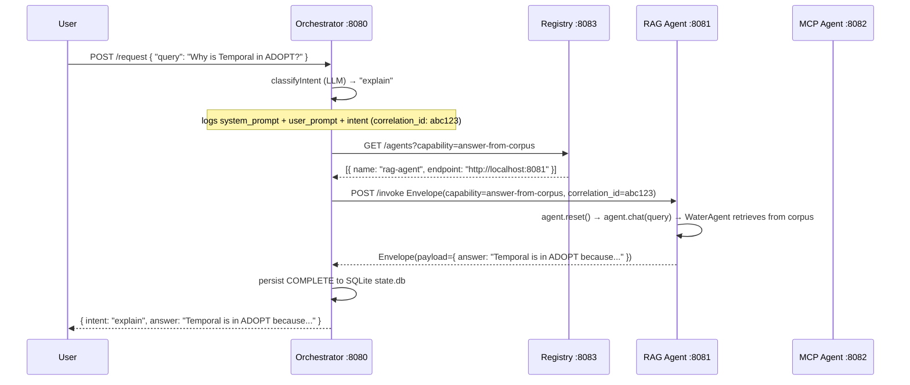
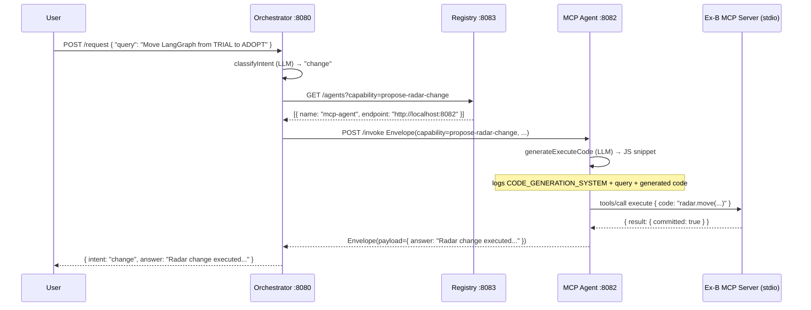

<h1 align="center">Exercise C — A2A Tech Radar Concierge</h1>

<p align="center">
  <font color="gray" size="3">
    Three agents, one registry, one orchestrator — composing Exercise A (RAG) and Exercise B (MCP) into a real A2A system
  </font>
</p>

**Authors:**
- Prem Kumar Reddy K
- Deepak P
- Pavitra P

**Cohort:** LLM Capability

---

## Table of Contents

- [About the Project](#about-the-project)
- [Learning Objectives](#learning-objectives)
- [Scenario and Composition Justification](#scenario-and-composition-justification)
- [System Architecture](#system-architecture)
- [Message Envelope](#message-envelope)
- [Orchestration vs Choreography](#orchestration-vs-choreography)
- [Required Stack](#required-stack)
- [Tech Stack](#tech-stack)
- [Project Structure](#project-structure)
- [Code File Descriptions](#code-file-descriptions)
- [Agent Registry](#agent-registry)
- [Failure Handling](#failure-handling)
- [Observability](#observability)
- [Installation Guide](#installation-guide)
- [Environment Variables](#environment-variables)
- [How to Run the Project](#how-to-run-the-project)
- [How to Test the Project](#how-to-test-the-project)
- [Outputs Generated](#outputs-generated)
- [Happy-Path Sequence Diagram](#happy-path-sequence-diagram)
- [Evaluation Rubric](#evaluation-rubric)
- [Explicit Non-Goals](#explicit-non-goals)
- [Version Control Expectations](#version-control-expectations)
- [Limitations](#limitations)
- [Future Enhancements](#future-enhancements)
- [Resources](#resources)
- [FAQ / Common Pitfalls](#faq--common-pitfalls)
- [Acknowledgements](#acknowledgements)

---

## About the Project

Exercise A produced a local RAG agent. Exercise B produced a token-efficient MCP server. They were two programs that didn't know about each other.

**Exercise C makes them one system.**

The **Tech Radar Concierge** is a four-process A2A system that lets a user ask natural-language questions about or propose changes to the Stack.TechRadar:

- A user sends a query in plain English to the **Orchestrator**.
- The orchestrator classifies the intent (explain vs change) using an LLM, then queries the **Registry** for the right agent.
- An **"explain"** query is dispatched to the **RAG Agent**, which answers from a corpus of Tech Radar history and ADR documents (Exercise A).
- A **"change"** query is dispatched to the **MCP Agent**, which generates a JavaScript code snippet and executes it against Exercise B's Tech Radar proxy (Exercise C).
- All messages travel as typed envelopes with `correlation_id`, `causation_id`, and `idempotency_key`. Every step is logged as structured JSON. Failures are retried with idempotency dedup, timed out cleanly, and dead-lettered after exhaustion.

> Two agents that don't know about each other are not a system. This exercise is where you make them one.

---

## Learning Objectives

| Process | Port | Capability |
|---|---|---|
| Registry | 8083 | agent discovery + heartbeat TTL |
| RAG Agent | 8081 | `answer-from-corpus` |
| MCP Agent | 8082 | `propose-radar-change` |
| Orchestrator | 8080 | `orchestrate` (user entry point) |

---

## Message Envelope

Every agent-to-agent message uses this typed struct, defined in `shared/envelope.ts` (TypeScript/Zod) and mirrored in `rag-agent/main.py` (Python/Pydantic). **The same envelope is used on every hop — never re-parsed into bespoke local types.**

```typescript
// shared/envelope.ts
import { z } from "zod";

export const EnvelopeSchema = z.object({
  correlation_id:  z.string().uuid(), // ties all hops of one user request together
  causation_id:    z.string().uuid(), // points at the direct parent message
  idempotency_key: z.string().uuid(), // receiver dedupes retries by storing seen keys
  sender:          z.string().min(1), // who sent this (e.g. "orchestrator")
  recipient:       z.string().min(1), // who should process it (e.g. "rag-agent")
  capability:      z.string().min(1), // what to do — matched against registry, never hardcoded
  payload:         z.record(z.unknown()), // capability-specific input
  timestamp:       z.string().datetime(), // ISO-8601 UTC
});

export type Envelope = z.infer<typeof EnvelopeSchema>;
```

**Field descriptions:**

| Field | One-sentence purpose |
|---|---|
| `correlation_id` | Stays the same across every message in one user request — the primary key for reconstructing a workflow from logs |
| `causation_id` | Points at the direct parent message — gives the "because of this" link in the trace chain |
| `idempotency_key` | Receivers store seen keys and return a cached response immediately if a key is seen again — prevents duplicate LLM calls and double-mutations on retry |
| `sender` | Name of the agent that sent the message — used for audit and routing replies |
| `recipient` | Name of the intended target agent — decoupled from the endpoint URL |
| `capability` | The capability string matched against the registry — never hardcoded to an agent name or URL |
| `payload` | Capability-specific structured input (e.g. `{ "query": "Why is Temporal in ADOPT?" }`) |
| `timestamp` | ISO-8601 UTC creation time — used to order events when logs arrive out of sequence |

---

## Orchestration vs Choreography

**Decision: Orchestration.** A central conductor (`orchestrator/main.ts`) owns every workflow step.

| Axis | Orchestration | Choreography | Winner |
|---|---|---|---|
| Cognitive load | One file, one SQLite table, one `GET /workflow/:id` | 3+ event topics, cross-process log join | Orchestration |
| Blast radius | Contained to orchestrator process; agents unaffected | Can cascade to all downstream consumers | Orchestration |
| Debuggability | Full audit trail per `correlation_id` in structured JSON | Requires cross-process timestamp reconstruction | Orchestration |
| Latency | +1 HTTP hop per step (~1–5ms on localhost) | Near-zero broker overhead | Choreography (irrelevant here) |
| Team-size scaling | Bottleneck at high agent count (5+) | Natural fan-out across independent teams | Choreography (N/A at 3 agents) |

The latency penalty and team-size scaling advantage of choreography are both irrelevant for 3 agents on localhost. We document this explicitly to show awareness, not because it changes the decision.

Full defence with scenario-specific reasoning: **`docs/topology-decision.md`**

---

## Required Stack

Per the exercise specification:

| Layer | We have | Not allowed |
|---|---|---|
| Agents | 4 separate processes (Registry + RAG + MCP + Orchestrator) | Single Python file with multiple classes pretending to be agents |
| Registry | Real service: `POST /register`, `DELETE /deregister/:name`, `GET /agents?capability=`, `GET /health`, heartbeat TTL eviction | Hardcoded agent URLs anywhere |
| Transport | **HTTP/JSON** across all agent pairs — single transport, documented below | Different ad-hoc protocols per pair |
| Message envelope | Zod-validated TypeScript struct + Pydantic Python mirror — every field populated on every hop | Bare JSON blobs |
| Observability | Structured JSON logs — `correlation_id` + `causation_id` + full prompts on every LLM call | Print-statement debugging |
| Orchestrator | Real orchestrator with persisted SQLite state + `GET /workflow/:id` endpoint | Single `if/else` ladder in one process |

**Why HTTP/JSON over gRPC, NATS, Redis Streams:**
All agents run on the same localhost machine for a development exercise. HTTP needs no broker infrastructure, no schema registry, and is trivially debuggable with `curl`. The envelope schema is enforced by Zod and Pydantic, not by the transport. For a multi-machine deployment, swapping to NATS or gRPC would require only changing the transport layer — the envelope stays the same.

---

## Tech Stack

| Component | Technology | Why we use it |
|---|---|---|
| **Orchestrator + Registry + MCP Agent** | TypeScript, Node.js 22 LTS, Express | Consistent with Exercise B; `isolated-vm` requires Node 22 |
| **RAG Agent** | Python 3.14, FastAPI, uvicorn | Re-uses Exercise A's `WaterAgent` (Python) without modification |
| **Envelope validation** | Zod (TypeScript) + Pydantic (Python) | Each language's best-in-class schema validator; same field names, same constraints |
| **Workflow state** | SQLite via `better-sqlite3` | Zero-infra, single-file persistence; sufficient for localhost exercise |
| **Structured logging** | `shared/logger.ts` (JSON to stdout) | Every log line is a flat JSON object; `jq` + `grep` on `correlation_id` reconstructs any workflow |
| **Exercise B MCP server** | Spawned as a stdio subprocess inside `mcp-agent/main.ts` | Reuses Exercise B unchanged; `McpClient` handles JSON-RPC framing over `stdin`/`stdout` |
| **Transport** | HTTP/JSON-RPC (via `fetch` and Express) | No broker required for localhost; trivially debuggable with `curl` |
| **Dead-letter store** | `dead-letter.jsonl` (newline-delimited JSON) | Operator-inspectable without tooling; each entry is a complete envelope + reason |

---

## Project Structure

```
exercise-c/
├── shared/
│   ├── envelope.ts          # Zod-validated message envelope (single source of truth)
│   └── logger.ts            # Structured JSON logger — makeLogger(agentName)
├── registry/
│   └── main.ts              # Agent registry :8083 — register / deregister / heartbeat / health
├── rag-agent/
│   ├── main.py              # FastAPI RAG agent :8081 — wraps Exercise A WaterAgent
│   ├── ingest_radar.py      # One-shot corpus ingestion into chroma_db/
│   ├── chroma_db/           # Auto-generated vector store (gitignored)
│   ├── aquaiq_ai/           # Exercise A source files (config.py, agent.py, retriever.py, etc.)
│   └── data/
│       ├── radar_history_2024.md   # Tech Radar history corpus
│       └── radar_decisions_adr.md  # ADR corpus
├── mcp-agent/
│   ├── main.ts              # MCP agent :8082 — LLM → JS code → Exercise B MCP via stdio
│   └── exercise-b-server/   # Exercise B MCP server source (proxy, sandbox, types, index)
├── orchestrator/
│   ├── main.ts              # Orchestrator :8080 — classify → lookup → dispatch → persist
│   └── state.db             # Auto-generated SQLite workflow state (gitignored)
├── tests/
│   ├── registry.test.ts     # Registry unit tests (supertest)
│   ├── envelope.test.ts     # Envelope validation unit tests
│   └── test_rag_agent.py    # RAG agent Python unit tests
├── docs/
│   ├── topology-decision.md         # Orchestration vs choreography defence (5 axes)
│   ├── observability-walkthrough.md # Real correlation_id walkthrough
│   └── failure-modes.md             # Chaos test + 4 failure modes
├── dead-letter.jsonl        # Auto-generated poison-message store (gitignored)
├── Makefile                 # install / ingest / up / down / demo / test / health
├── package.json
└── tsconfig.json
```

---

## Code File Descriptions

- **`shared/envelope.ts`** — Single source of truth for the message envelope. Zod schema enforces all 8 fields on parse. `parseEnvelope(raw)` throws on invalid input — agents reject malformed envelopes at the boundary, not deep in business logic.

- **`shared/logger.ts`** — `makeLogger(agentName)` returns a structured JSON logger. Every log line is a flat JSON object with `timestamp`, `level`, `agent`, `correlation_id`, and optional `causation_id`, `capability`, and extra fields. LLM calls log the exact `system_prompt` and `user_prompt` so "why did X call Y?" is answerable from logs alone.

- **`registry/main.ts`** — In-memory capability registry. Implements `POST /register`, `DELETE /deregister/:name`, `POST /heartbeat/:name`, `GET /agents?capability=`, and `GET /health`. Agents that miss 2 consecutive 20-second heartbeat cycles (40 s TTL) are evicted. Exported as `app` so registry tests can import it without starting the server.

- **`orchestrator/main.ts`** — Central conductor. Classifies intent via Azure OpenAI (with keyword-heuristic fallback), looks up the right agent in the registry, dispatches via `dispatch()` with 15 s timeout and 3-attempt exponential-backoff retry, persists every step to SQLite `workflow_steps`, writes exhausted envelopes to `dead-letter.jsonl`. Exposes `POST /request`, `GET /workflow/:id`, and `GET /health`.

- **`rag-agent/main.py`** — FastAPI service wrapping Exercise A's `WaterAgent`. Registers with the registry on startup, sends heartbeats, deduplicates by `idempotency_key`. On each `/invoke`, resets the agent's conversation history (stateless per A2A call), calls `agent.chat(query)`, and returns the answer in a new envelope.

- **`mcp-agent/main.ts`** — Node.js service that wraps Exercise B's MCP server. `McpClient` spawns `exercise-b-server/src/index.ts` as a stdio subprocess, performs the MCP `initialize` handshake, and calls `tools/call execute` with LLM-generated JavaScript code. The LLM prompt (`CODE_GENERATION_SYSTEM`) and the generated code are both logged with `correlation_id`.

- **`rag-agent/ingest_radar.py`** — One-shot script that ingests `data/radar_history_2024.md` and `data/radar_decisions_adr.md` into a `radar_local` ChromaDB collection using Exercise A's `OllamaEmbedder` (768-dim, `nomic-embed-text`). Only needs to run once.

---

## Agent Registry

The registry implements the four endpoints required by the spec, plus a heartbeat endpoint:

| Endpoint | Method | Purpose |
|---|---|---|
| `/register` | POST | Agent declares name, capabilities, endpoint, health\_url. Returns 201. |
| `/deregister/:name` | DELETE | Graceful shutdown — agent removes itself. Returns 404 if unknown. |
| `/heartbeat/:name` | POST | Agent refreshes its `last_heartbeat` timestamp. Sent every 20 s. |
| `/agents?capability=` | GET | Returns all registered agents, optionally filtered by capability string. Runs `evictStale()` before filtering. |
| `/health` | GET | Registry health + per-agent `last_heartbeat_age_ms`. |

**TTL eviction:** agents that miss 2 consecutive 20-second heartbeats (40 s TTL) are removed from the in-memory store. A stale eviction is logged at `WARN` level with the agent name. After eviction, `GET /agents?capability=propose-radar-change` returns an empty list and the orchestrator returns `HTTP 503` — a clean, observable failure state rather than a silent hang.

---

## Failure Handling

All four failure modes required by the spec are implemented:

| Mode | Where handled | What happens |
|---|---|---|
| **Timeout** | `orchestrator/main.ts` `dispatch()` | `AbortController` with 15 s deadline. Logs `TIMED_OUT`, persists to SQLite, returns `HTTP 504` with `correlation_id`. If the timed-out call was a radar mutation, also logs `PARTIAL` — radar state may have changed before timeout. |
| **Retries + idempotency** | Orchestrator retries; each agent deduplicates | 3 attempts, exponential backoff (1 s → 2 s → 4 s). Same `idempotency_key` reused on all retries. Agents maintain `seenKeys` and return a cached dedup response immediately if the key is seen again. |
| **Partial completion** | Orchestrator, post-dispatch | If MCP commits the radar but the HTTP response is lost, the orchestrator logs `PARTIAL` with "radar state unknown, check MCP agent logs". Recovery is manual: inspect `config.json` directly. |
| **Poison message** | Orchestrator, after all retries exhausted | Envelope written to `dead-letter.jsonl` with `dead_letter_reason` and `dead_letter_at`. Not retried further. Operator-inspectable without tooling. |

Full chaos test procedure, expected log output, and post-mortem: **`docs/failure-modes.md`**

---

## Observability

Every log line is a structured JSON object with at minimum:

```json
{
  "timestamp": "2026-06-05T10:00:00.000Z",
  "level": "INFO",
  "agent": "orchestrator",
  "correlation_id": "abc-123",
  "message": "intent classified"
}
```

**The key invariant:** LLM-driven routing decisions log the exact `system_prompt` and `user_prompt` alongside the `correlation_id`. This means the question *"why did the orchestrator route to the RAG agent?"* can be answered in under 30 seconds by filtering logs on `correlation_id`:

```bash
# Reconstruct a full workflow from structured logs
grep '"correlation_id":"<uuid>"' orchestrator.log | jq .
```

**Inspect workflow state from SQLite:**

```bash
curl http://localhost:8080/workflow/<correlation_id> | jq .
```

Returns every step with timestamp, agent, capability, and status (`STARTED` → `DISPATCHED` → `COMPLETE` / `TIMED_OUT` / `PARTIAL` / `FAILED`).

Full walkthrough with a real `correlation_id`: **`docs/observability-walkthrough.md`**

---

## Installation Guide

### Prerequisites

- **Node.js 22 LTS** — `isolated-vm` inside Exercise B requires Node 22; Node 23+ breaks the native build
  ```bash
  brew install node@22
  ```
- **Xcode CLI tools** — required to compile `isolated-vm`
  ```bash
  xcode-select --install
  ```
- **Python venv from Exercise A** — the RAG agent re-uses the existing `aquaiq-ai` Poetry virtualenv. It must have `fastapi`, `uvicorn`, `httpx`, and all Exercise A deps installed.
- **Ollama running locally** with `nomic-embed-text` and `gemma4:e4b` (or `fest-agent`) pulled — the RAG agent uses `LLM_PROFILE=local` by default.
- **Azure OpenAI credentials** in the root `.env` — the orchestrator and MCP agent use Azure OpenAI for intent classification and code generation.

> **Intel Mac?** Replace `/opt/homebrew` with `/usr/local` in every command below.

### Setup

1. **Clone the repository and check out the branch**
   ```bash
   git clone https://github.com/LLM-build-capability/Aquaiq-AI.git
   cd Aquaiq-AI
   git checkout premkumar/exercise-c
   ```

2. **Install Node dependencies**
   ```bash
   cd exercise-c
   make install
   ```

3. **Ingest the radar corpus** (run once — writes to `exercise-c/rag-agent/chroma_db/`)
   ```bash
   make ingest
   ```
   This uses Exercise A's `OllamaEmbedder` with `nomic-embed-text` (768-dim). Ollama must be running.

4. **Verify the `.env` file** at the repo root contains valid Azure OpenAI credentials:
   ```bash
   # Required for orchestrator (intent classification) and mcp-agent (code generation)
   AZURE_OPENAI_API_KEY=your_key
   AZURE_OPENAI_ENDPOINT=https://your-resource.openai.azure.com/
   API_VERSION=2024-12-01-preview
   AZURE_OPENAI_DEPLOYMENT=gpt-5.4-nano
   LLM_PROFILE=local
   ```

---

## Environment Variables

| Variable | Default | Used by | Purpose |
|---|---|---|---|
| `AZURE_OPENAI_API_KEY` | — | Orchestrator, MCP Agent | Azure OpenAI authentication |
| `AZURE_OPENAI_ENDPOINT` | — | Orchestrator, MCP Agent | Azure OpenAI resource endpoint |
| `API_VERSION` | `2024-12-01-preview` | Orchestrator, MCP Agent | Azure OpenAI API version |
| `AZURE_OPENAI_DEPLOYMENT` | `gpt-5.4-nano` | Orchestrator, MCP Agent | Model deployment name |
| `LLM_PROFILE` | `local` | RAG Agent | `local` = Ollama + nomic-embed-text; `cloud` = Azure OpenAI embeddings |
| `REGISTRY_URL` | `http://localhost:8083` | All agents | Registry endpoint — change if running on different host |
| `ORCHESTRATOR_PORT` | `8080` | Orchestrator | Listening port |
| `RAG_AGENT_PORT` | `8081` | RAG Agent | Listening port |
| `MCP_AGENT_PORT` | `8082` | MCP Agent | Listening port |
| `NODE_BIN` | `/opt/homebrew/opt/node@22/bin/node` | MCP Agent | Path to Node 22 binary — change on Intel Mac |

---

## How to Run the Project

### Start all processes

```bash
cd exercise-c
make up
```

Starts all four processes in the background with staggered startup (registry first, then agents, then orchestrator). All processes run on `localhost`.

### Send a demo query

```bash
make demo          # explain query → routes to RAG Agent
make demo-change   # change query → routes to MCP Agent
```

### Check all agents are healthy

```bash
make health
```

### Stop all processes

```bash
make down
```

### Inspect a workflow

```bash
curl http://localhost:8080/workflow/<correlation_id> | jq .
```

Returns every SQLite step for that `correlation_id` in timestamp order.

---

## How to Test the Project

### TypeScript tests (registry + envelope)

```bash
make test
# or just TypeScript:
PATH="/opt/homebrew/opt/node@22/bin:$PATH" npm run test
```

### Python tests (RAG agent)

```bash
make test
# or just Python:
/path/to/poetry/venv/bin/python -m pytest tests/test_rag_agent.py -v
```

### Type check only (no output = pass)

```bash
make check
# or:
PATH="/opt/homebrew/opt/node@22/bin:$PATH" npm run check
```

### Troubleshooting

| Symptom | Fix |
|---|---|
| `npm install` fails with `isolated-vm` build error | Run `xcode-select --install` first |
| `make up` hangs on RAG Agent | Ollama not running — start with `ollama serve` |
| `make demo` returns `503 No agent available` | Agents not yet registered — wait ~3 s after `make up` and retry |
| Orchestrator returns `500` on change queries | Azure OpenAI credentials missing or invalid in `.env` |
| `make ingest` fails with embedding error | `nomic-embed-text` not pulled — run `ollama pull nomic-embed-text` |
| Registry shows 0 agents after `make up` | Agents failed to start — check individual process stderr logs |

---

## Outputs Generated

After `make up`:
- Four background processes listening on ports 8080–8083
- Registry populated with 3–4 registered agents (orchestrator + rag-agent + mcp-agent)
- `orchestrator/state.db` created (SQLite, gitignored)

After `make ingest`:
- `rag-agent/chroma_db/` populated with `radar_local` collection (~50 vectors from 2 markdown files)

After a workflow request:
- Structured JSON log lines printed to each process's stdout
- SQLite `workflow_steps` rows written for every step (receive → classify → lookup → dispatch → complete/fail)

After a poison-message scenario:
- `dead-letter.jsonl` written (gitignored) with the exhausted envelope + reason + timestamp

---

## Happy-Path Sequence Diagram



**Change-path variant** (intent = "change"):



---

## Evaluation Rubric

| Criterion | What we look for | Weight | Our assessment |
|---|---|---|---|
| **System works end-to-end** | Three agents up, registry queryable, chosen scenario runs to meaningful output | 20% | `make up && make demo && make demo-change` runs both paths end-to-end |
| **Protocol discipline** | Envelope consistent; correlation/causation/idempotency populated and used; capabilities matched from registry, not hardcoded | 20% | Zod+Pydantic validation on every hop; all 8 envelope fields populated; capabilities queried from `REGISTRY_URL` |
| **Topology defence** | Orchestration vs choreography named, scored against axes, honest about trade-offs | 15% | `docs/topology-decision.md` — 5 axes, summary table, scale-out risk acknowledged |
| **Observability** | "Why did X call Y" answerable from logs alone for any `correlation_id`. LLM decisions show their prompts | 15% | All LLM calls log `system_prompt` + `user_prompt`; `GET /workflow/:id` reconstructs SQLite state; `docs/observability-walkthrough.md` |
| **Failure handling** | Timeouts, retries-with-idempotency, partial-completion, poison-message addressed in code. At least one chaos test recorded | 15% | All 4 modes implemented and documented; chaos test in `docs/failure-modes.md` |
| **Composition honesty** | Each agent does something the others can't. System is more than the sum of its parts | 10% | RAG = read-only corpus; MCP = write-only mutation via code execution; Orchestrator = stateful coordination |
| **Engineering discipline** | Modular code; types; readable commits; one-command setup | 5% | TypeScript + Pydantic throughout; `make up` starts everything; this README |

**Total: 100%. Passing bar: ≥ 70%.**

---

## Explicit Non-Goals

| Not in scope | Why |
|---|---|
| Production deployment to Azure / Kubernetes | Local-only is fine; the patterns transfer |
| Building a custom LLM-routing platform | Exercise A's `WaterAgent` is used as-is |
| Agent-driven prompt-injection mitigation beyond awareness | Mentioned as a gap; full mitigation is larger than this exercise |
| Wire-compatible Ecolab Agent Registry implementation | Spec-aligned shape is enough; full compatibility is a follow-on |
| Dynamic agent code-loading / sandboxing | That's Exercise B's Code Mode pattern; here we compose, we don't reload |
| More than 5 agents | Three is the bar; four is fine; five is a code smell |

---

## Version Control Expectations

- **Agent skeletons committed before business logic** — registry, RAG agent, and MCP agent each registered and health-checked before any routing logic shipped.
- **Message envelope committed as a typed module first** — `shared/envelope.ts` was committed before any agent used it.
- **No logs or traces with PII committed** — all test queries use synthetic Tech Radar scenarios; no names or emails in committed data.
- **No model weights committed** — `*.gguf`, `chroma_db/`, `state.db`, `dead-letter.jsonl`, and `vectors.json` are all gitignored.

---

## Limitations

- **Orchestrator state is in-memory + SQLite only.** If the orchestrator restarts mid-workflow, in-flight requests are lost (the SQLite row is in `DISPATCHED` status but never resolved). A recovery pass on startup that re-dispatches `DISPATCHED` rows would fix this.
- **Registry is in-memory.** A registry restart clears all registered agents. Agents re-register on their next heartbeat cycle (up to 20 s delay). For production, persistent storage (Redis, Postgres) would be needed.
- **No TLS between agents.** All inter-agent calls are plain HTTP on localhost. For a multi-machine deployment, TLS + mTLS would be required.
- **LLM-generated code is not sandboxed at the MCP agent level.** Code generation by the LLM happens in `mcp-agent/main.ts` (Azure OpenAI). The generated code is then sent to Exercise B's `execute()` tool, which *does* sandbox it in `isolated-vm`. The intermediate step (the prompt result before it hits the sandbox) is trusted.
- **Single-tenant radar.** All agents share the same `config.json` snapshot. Concurrent writes from multiple sessions could corrupt the radar state. Exercise B's multi-tenant stretch would fix this.
- **`ollama2a` not used.** We evaluated `ollama2a` and chose not to use it — the A2A contract we needed (custom envelope, custom registry, typed Zod schema) would have required overriding most of its defaults. A direct FastAPI + Express implementation was cleaner.

---

## Future Enhancements

These map to the spec's Stretch Challenges:

1. **Fully local A2A** *(Stretch 1)* — Run every agent including the orchestrator's intent classifier against a local model. Replace Azure OpenAI calls in `orchestrator/main.ts` and `mcp-agent/main.ts` with Ollama.
2. **Hot-swap a model** *(Stretch 2)* — Swap the RAG agent's model without restarting the orchestrator. The registry re-discovers the new endpoint on the next capability query.
3. **Policy-gate agent** *(Stretch 3)* — Add a fourth agent that vets every envelope before it is forwarded. Define "vet" concretely (PII strip, banned-term refusal, data-class check).
4. **Topology bake-off** *(Stretch 4)* — Implement the same workflow under choreography (NATS or Redis Streams). Run identical chaos tests. Report which broke first.
5. **Schema-enforced envelope** *(Stretch 6)* — Protobuf or Avro envelope with a versioned schema registry. Bump a field type and show version negotiation.
6. **Orchestrator crash recovery** — On startup, re-dispatch all `workflow_steps` rows in `DISPATCHED` status that were never resolved.
7. **Persistent registry** — Back the in-memory agent store with Redis or SQLite so a registry restart doesn't evict all agents.

---
