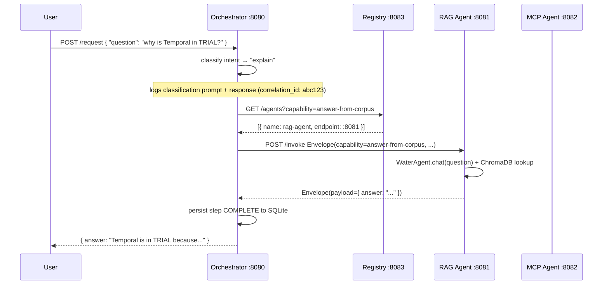

# Exercise C — A2A Multi-Agent Orchestration: Team Plan

| | |
|---|---|
| **Exercise** | C — Compose A + B into a real A2A system |
| **Team** | Deepak · Pavitra · Premkumar |
| **Repo** | `Documents/Aquaiq-AI` (active repo — not `PycharmProjects/Aquaiq-AI`) |
| **Base branch** | `team/exercise-c` (already exists on remote, currently empty — do NOT push directly to it) |
| **Personal branches** | `deepak/exercise-c`, `pavitra/exercise-c`, `premkumar/exercise-c` → PR into `team/exercise-c` |
| **Created** | 2026-06-02 |

---

## 1. What Exercise C Actually Is

Exercise A (Local RAG) and Exercise B (MCP Server) are today two programs that don't know each other exist. Exercise C wires them into a real **A2A (agent-to-agent) system**: multiple independent **agent processes** that discover each other through a **registry service**, talk over **one shared transport**, use **one typed message envelope** everywhere, and are fully observable from logs alone.

The graders read the **protocol and composition** — not the depth of the business workflow. The spec explicitly says: if a happy-path run takes >30 seconds, your scenario is too big. Keep it tight.

---

## 2. Scenario Choice — Tech Radar Concierge

### What we're building

A user sends one natural-language query. The orchestrator decides whether it's an **explanation request** ("why is Temporal in TRIAL?") or a **change proposal** ("move Temporal to ADOPT"). It routes to the right agent:

- **RAG agent** → answers the *why* from a corpus of past Tech Radar snapshots, ADRs, blog posts.
- **MCP agent** → *executes* the proposed change via Exercise B's `execute` tool.

One workflow, two distinct capabilities, one real artifact (the radar) at the end.

### Why this scenario and not the others

| Option considered | Decision | Reason |
|---|---|---|
| **Tech Radar Concierge** ✅ | **Chosen** | Exercise B already owns the radar domain. Re-ingesting Exercise A's RAG on radar history is ~1–2 hrs work and zero code change to the retriever. The read/write split (RAG explains, MCP edits) is airtight and maps exactly to the grader's rubric on composition honesty. |
| Keep water-treatment corpus, invent a bridge | Rejected | Water treatment and tech radar share no domain. The composition seam would be artificial and the graders would penalise it under "composition honesty (10%)". |
| Repurpose Exercise B's proxy to a ticket backend | Rejected | This means reworking Prem's `proxy.ts` and the `RadarProxyImpl` — throwing away the core of Exercise B. More code, weaker story. |
| SOP Assistant (water RAG → MCP ticket) | Rejected | Same cross-domain problem as option 2, plus rework on B. |

### What each agent uniquely contributes

| Agent | Unique capability | Why no other agent can do it |
|---|---|---|
| RAG agent | `answer-from-corpus` — semantic search over radar history + ADRs | The MCP agent has no corpus. The orchestrator has no vector store. |
| MCP agent | `propose-radar-change` — executes typed mutations against the live radar via `isolated-vm` sandbox | The RAG agent is read-only. The orchestrator doesn't own the domain types. |
| Orchestrator | Intent classification → registry lookup → dispatch → compose reply | Neither business agent understands the full request; each only knows its capability. |

---

## 3. Architecture

### 3.1 Process map (4 processes on localhost)

```
User terminal / CLI
       │
       ▼
┌──────────────────────────────────┐
│  Orchestrator  :8080             │  ← Python (FastAPI)
│  • classifies intent             │
│  • queries registry              │
│  • dispatches via envelope       │
│  • persists workflow state →     │
│    SQLite (exercise-c/state.db)  │
└────────┬─────────────────────────┘
         │ HTTP + message envelope
 ┌───────┴────────────────────────────────────┐
 │                                            │
 ▼                                            ▼
┌───────────────────┐             ┌────────────────────────┐
│  RAG Agent  :8081  │             │  MCP Agent  :8082      │
│  capability:       │             │  capability:            │
│  answer-from-corpus│             │  propose-radar-change   │
│                    │             │                         │
│  Wraps WaterAgent  │             │  Thin Python wrapper    │
│  + ChromaDB (radar │             │  that spawns Exercise B │
│    corpus)         │             │  Node 22 process over   │
│                    │             │  stdio JSON-RPC         │
└────────────────────┘             └────────────────────────┘
         │                                    │
         ▼ register/heartbeat                 ▼ register/heartbeat
┌──────────────────────────────────┐
│  Registry  :8083                 │  ← Python (FastAPI)
│  POST /register                  │
│  DELETE /deregister/:name        │
│  GET /agents?capability=…        │
│  GET /health                     │
│  TTL heartbeat (30s)             │
└──────────────────────────────────┘
```

### 3.2 Topology decision — Orchestration (not choreography)

**We chose orchestration.** One central conductor maintains workflow state in SQLite, dispatches each step, retries failed calls, and is the single place to ask "where is this request right now?"

| Axis | Orchestration | Choreography | Why orchestration wins here |
|---|---|---|---|
| Cognitive load (new engineer) | Low — one file owns the flow | High — must trace 3 event topics | We have 3 agents, not 30. Central state is readable. |
| Blast radius | Contained — orchestrator dies, state survives in SQLite | Scattered — any agent's event queue can become a poison backlog | SQLite restart recovery is a 5-line fix. |
| Debuggability | "Why did X call Y" is in orchestrator's state log | Must reconstruct from event ordering across 3 brokers | Assignment says answer this in <30s from logs; orchestration makes it trivial. |
| Latency | One extra hop per step | Near-zero broker latency | At 3 agents on localhost, the hop is <5ms. Not a concern. |
| Scale (2× team next year) | Becomes a bottleneck at high concurrency | Scales naturally | At 3 agents on localhost this is hypothetical; we note it honestly in the topology doc. |

Full write-up in `docs/topology-decision.md` (Phase 7 deliverable).

### 3.3 Transport

**HTTP/JSON** between all agents. Every request body IS the message envelope (not a wrapper around it). Chosen because:
- No infra to stand up (no NATS, no Redis).
- Fits the exercise's "one transport across all agents" rule.
- The envelope's `idempotency_key` is trivially deduped with a small SQLite set in each agent.

---

## 4. Message Envelope

This is committed as a **standalone typed module** before any agent logic ships (doc's explicit rule).

```python
# exercise-c/shared/envelope.py
from pydantic import BaseModel
from datetime import datetime, timezone
from typing import Any

class Envelope(BaseModel):
    correlation_id: str   # Same across all messages in one user request (trace root)
    causation_id: str     # The message_id of the message that caused this one
    idempotency_key: str  # Receiver dedupes retries by storing seen keys
    sender: str           # Agent name (e.g. "orchestrator", "rag-agent")
    recipient: str        # Agent name or "registry"
    capability: str       # What the recipient is being asked to do
    payload: dict[str, Any]  # Capability-specific data
    timestamp: str        # ISO-8601 UTC; set by sender at creation time
```

Each field explained:

| Field | Job |
|---|---|
| `correlation_id` | Ties every hop of one user request together — the primary key for log queries |
| `causation_id` | Points at the direct parent message — lets you reconstruct the exact call tree |
| `idempotency_key` | The receiver stores seen keys; a retry with the same key is silently deduped |
| `sender` | Who sent this — needed for observability ("X called Y") |
| `recipient` | Who should process it — orchestrator uses this to route, not hardcoded URLs |
| `capability` | What to do — matched against registry, never hardcoded |
| `payload` | The capability-specific input (question text, radar change params, etc.) |
| `timestamp` | When it was created — used for timeout checks and ordering in log replay |

---

## 5. Work Split

> **Note on split:** Deepak and Premkumar carry equal full loads. Pavitra has a lighter slice (MCP agent stub + 1 doc) because she will have limited availability during this exercise.

| Owner | Slice | Capability area | Est. effort |
|---|---|---|---|
| **Premkumar** | Registry + shared envelope + shared logger + observability layer + 2 docs | Infrastructure + docs | ~1.5 days |
| **Deepak** | Orchestrator + RAG agent A2A wrapper + re-ingest corpus + Makefile + README | Core composition | ~1.5 days |
| **Pavitra** | MCP agent A2A wrapper skeleton (wired to Node B process) + `failure-modes.md` | MCP bridge + 1 doc | ~0.5 days |

Detail below.

### Premkumar's slice

**Shared envelope module** (`exercise-c/shared/envelope.py`)

The Pydantic model from section 4. Every agent and the registry import from this single file. No other file re-defines the fields. **This is committed first, before anyone else writes code.**

**Shared structured logger** (`exercise-c/shared/logger.py`)

A tiny structured JSON logger every agent imports. Every log line is a JSON object with at minimum `{ timestamp, level, agent, correlation_id, message }`. This is the observability substrate the whole team depends on — ship it immediately after the envelope.

**Registry service** (`exercise-c/registry/`)

FastAPI app on `:8083`. Shape modelled on `docs/designs/agent-registry-spec.html` (read before building).

```
POST   /register              body: { name, capabilities: str[], endpoint, health_url }
DELETE /deregister/:name
POST   /heartbeat/:name
GET    /agents?capability=…   returns list filtered by capability string
GET    /health                registry health + aggregated per-agent health
```

Heartbeat / TTL: agents POST `/heartbeat/:name` every 20 seconds. If an agent misses 2 heartbeats (>40s), it is evicted. Orchestrator logs a WARNING if it queries for a capability and gets an empty list.

**Observability layer** (wire-up across all agents, after Deepak and Pavitra have their skeletons up)

Ensure every agent logs **every envelope hop** as a structured JSON line using `shared/logger.py`. At minimum: `timestamp`, `level`, `agent`, `correlation_id`, `causation_id`, `capability`, `message`.

For every LLM-driven decision in the orchestrator, the log must include the **exact prompt** and the **LLM response**. This is required to pass the observability rubric.

**Docs (Prem writes these two):**
- `docs/topology-decision.md` — one page scored against the 5 axes in section 3.2. The content is already outlined there; write it up formally.
- `docs/observability-walkthrough.md` — pick one real `correlation_id` from a workflow run; walk through the log lines; answer "why did the orchestrator call the RAG agent?" and "why did it call the MCP agent?" from logs alone.

**Commit order for Prem:**
1. `feat(exercise-c): add shared envelope module` — just `shared/envelope.py`, nothing else
2. `feat(exercise-c): add shared structured logger` — `shared/logger.py`
3. `feat(exercise-c): add registry skeleton — register/deregister/health endpoints`
4. `feat(exercise-c): add heartbeat TTL eviction to registry`
5. `feat(exercise-c): add envelope hop logging to all agents` (after skeletons are up)
6. `docs(exercise-c): add topology-decision.md`
7. `docs(exercise-c): add observability-walkthrough.md with real correlation_id trace`

---

### Deepak's slice

**RAG agent A2A wrapper** (`exercise-c/rag-agent/`)

Python FastAPI service on `:8081`. On startup: registers with the registry (`capability: "answer-from-corpus"`), starts a heartbeat loop, exposes `POST /invoke` and `GET /health`.

`POST /invoke` receives an `Envelope`, validates the `capability` field is `answer-from-corpus`, calls `WaterAgent.chat(payload["question"])`, returns a response `Envelope` (new `causation_id` pointing at inbound `correlation_id`).

**Re-ingest step:** swap the water-treatment PDFs for tech-radar history corpus (see section 6). The RAG code — `ingest.py`, `retriever.py`, `agent.py` — does not change. Only the files in `data/` change. Point `CHROMA_PERSIST_DIR` at `exercise-c/rag-agent/chroma_db/`.

Uses `deepak/local-mode` branch's Gemma/Ollama client if Ollama is running, falls back to Azure OpenAI otherwise. The profile factory from `local-mode` already handles this.

**Orchestrator** (`exercise-c/orchestrator/`)

Python FastAPI service on `:8080`. On startup: registers with the registry (`capability: "orchestrate"`), initialises SQLite `state.db`.

`POST /request` — the user entry point. Flow:
1. Generate `correlation_id` (UUID4), `idempotency_key`.
2. Classify intent: "explain" (→ RAG) vs "change" (→ MCP). Small LLM prompt or keyword heuristic; **log the exact prompt** to satisfy the observability rubric.
3. Query registry `GET /agents?capability=answer-from-corpus` (or `propose-radar-change`).
4. Build outbound `Envelope` with `causation_id = correlation_id` (first hop).
5. `POST /invoke` on the chosen agent's endpoint. Retry up to 3 times with exponential backoff (1s, 2s, 4s); each retry reuses the same `idempotency_key`.
6. Persist every state transition to SQLite: `(correlation_id, step, agent, capability, timestamp, status)`.
7. Compose and return the final response.

**Per-call timeout:** 15 seconds. If it expires: log TIMED_OUT with `correlation_id`, mark workflow in SQLite, return structured error to user.

**Makefile** (`exercise-c/Makefile`) — `make up` starts all 4 processes in order: registry → rag-agent → mcp-agent → orchestrator. `make down` kills them all.

**README.md** (`exercise-c/README.md`) — scenario description, envelope code block with field descriptions, one-command setup, one-command run, the mermaid sequence diagram from section 14.

**Commit order for Deepak:**
1. `feat(exercise-c): add rag-agent skeleton — register, health, invoke stub`
2. `feat(exercise-c): add orchestrator skeleton — register, health, request stub`
3. `feat(exercise-c): wire rag-agent to WaterAgent with re-ingested radar corpus`
4. `feat(exercise-c): wire orchestrator intent classification and dispatch`
5. `feat(exercise-c): add retry + timeout + SQLite state persistence to orchestrator`
6. `feat(exercise-c): add Makefile for one-command startup`
7. `docs(exercise-c): add README with scenario, envelope, and mermaid diagram`

---

### Pavitra's slice

**MCP agent A2A wrapper** (`exercise-c/mcp-agent/`)

Python FastAPI service on `:8082`. On startup: registers with the registry (`capability: "propose-radar-change"`), spawns the Exercise B Node 22 process as a subprocess (via `asyncio.create_subprocess_exec`), communicates over stdio JSON-RPC using the MCP protocol.

`POST /invoke` receives an `Envelope` with `capability: "propose-radar-change"`, builds the MCP `tools/call` JSON-RPC request for the `execute` tool, pipes it to the Node process, reads the response, wraps it in a response `Envelope`.

Graceful shutdown: on SIGTERM, sends `deregister` to the registry, kills the Node subprocess, exits.

**Node 22 constraint:** the subprocess must use `/opt/homebrew/opt/node@22/bin/node` explicitly. Add a comment in `main.py` and in the README block explaining why.

**`docs/failure-modes.md`** — Pavitra writes this one doc:
- The four failure modes: timeout, retries+idempotency, partial completion, poison message. Explain how the design handles each (reference the orchestrator's SQLite state and dead-letter.jsonl).
- The chaos test: kill the MCP agent mid-workflow, document what the user sees and what the logs show, confirm whether the radar was mutated before the kill.

**Commit order for Pavitra:**
1. `feat(exercise-c): add mcp-agent skeleton — register, health, invoke stub`
2. `feat(exercise-c): wire mcp-agent to Exercise B Node process over stdio`
3. `docs(exercise-c): add failure-modes.md with chaos test`

---

## 6. Failure Handling (shared requirement — code it in your slice)

Each agent is responsible for the failure modes at its boundary.

| Mode | Where handled | Implementation |
|---|---|---|
| **Timeout** | Orchestrator | 15s `asyncio.wait_for` around each `POST /invoke`; logs WARN with `correlation_id`; sets workflow status = TIMED_OUT in SQLite |
| **Retries + idempotency** | Orchestrator → RAG/MCP agent | 3 retries, exponential backoff (1s, 2s, 4s); same `idempotency_key` every retry. Each agent stores seen keys in a local SQLite set; duplicate key → return the same response immediately, do not re-execute. |
| **Partial completion** | Orchestrator | If MCP agent succeeds but final-compose step fails, the radar is mutated but the user sees an error. Logged as PARTIAL. The orchestrator's SQLite row shows which steps completed — re-run from the last good step is possible (documented but not auto-implemented). |
| **Poison message** | Each agent | Any envelope that fails 3+ times (tracked by `idempotency_key` + fail count in SQLite) is written to `exercise-c/dead-letter.jsonl` and dropped from the retry queue. An alert line is logged at ERROR level. |

### Chaos test (Pavitra documents, Deepak assists)

1. Start all 4 processes with `make up`.
2. Send a request that routes to the MCP agent.
3. While the orchestrator is waiting for the MCP agent's response, kill the MCP agent (`kill -9`).
4. Observe: orchestrator hits timeout (15s), logs TIMED_OUT, returns error to user. Registry evicts the MCP agent after its next missed heartbeat.
5. Document: what the user sees, what the log shows, whether the radar was mutated before the kill.
6. Record in `docs/failure-modes.md`.

---

## 7. Re-Ingesting the RAG Corpus

The current `data/` folder has four water-treatment PDFs. For Tech Radar Concierge, we replace them with tech-radar history documents. You don't change any RAG code — only the files in `data/`.

**What to put in `exercise-c/rag-agent/data/`:**

The radar corpus should answer "why was X placed here / moved here?" type questions. Good sources:

1. Export the current `exercise-b/data/config.json` as a human-readable markdown ("as of 2026.04, these technologies are on the radar in these rings, with these team assignments"). Write this by hand — 1–2 pages is enough.
2. Add any existing ADR or decision documents the team has (check `docs/training/architecture-exercises/` — the exercise decision files are good candidates).
3. Optionally add 2–3 short made-up "radar history notes" explaining past ring changes (e.g., "GPT-3.5 Turbo moved to HOLD in Q1 2026 because context limits constrained production use"). These are fine for the exercise — just don't put real PII in them.

**Do NOT delete or modify the original `data/` PDFs** — they live in the root repo and Exercise A still references them.

**Who does this:** Deepak (same person wrapping the RAG agent). Place new PDFs/markdown in `exercise-c/rag-agent/data/`. Point `CHROMA_PERSIST_DIR` at `exercise-c/rag-agent/chroma_db/` so the new collection doesn't collide with the existing water one.

**To re-ingest:** `python src/aquaiq_ai/ingest.py` with the env var pointing at the new data dir. The ingest code already checks for an existing collection and skips if found — so delete `exercise-c/rag-agent/chroma_db/` first if you need to re-run.

---

## 8. Prerequisites — Before Writing Any Code

### 8.1 Required reading (~1 hour total)

These three docs define the registry shape and envelope contract your implementation must be "recognisable from." Deviations are allowed but must be defended.

| Doc | Location | What to extract |
|---|---|---|
| `docs/strategies/a2a-strategy.html` | Bootcamp repo / Azure DevOps wiki | The A2A contract: what a well-formed agent-to-agent message must contain |
| `docs/designs/agent-registry-spec.html` | Same | The exact register/deregister/query/health endpoint shapes; the heartbeat/TTL rules |
| `docs/designs/observability-contract.md` | Same | Which fields every log line must have; what a `correlation_id` trace must reconstruct |

These files are **not in this repo.** Check:
- The Azure DevOps wiki for the LLM Capability team.
- The bootcamp cohort Teams/Slack channel — Thijs likely posted links.
- Ask Thijs directly if you can't find them.

> **If you cannot find them before starting:** use the envelope and registry shapes in this doc as your working baseline. Note in your `topology-decision.md` that the spec docs were not accessible locally; your design is spec-inspired, not wire-compatible.

### 8.2 Tooling checklist

Run through this before you write any code:

```bash
# Python (Exercise A, orchestrator, registry, RAG wrapper, MCP wrapper)
python --version          # 3.11+
pip show fastapi pydantic chromadb openai   # should all resolve
# or: cd Documents/Aquaiq-AI && poetry shell

# Node 22 (Exercise B must use this — not 26)
export PATH="/opt/homebrew/opt/node@22/bin:$PATH"
node --version            # v22.x
cd exercise-b && npm install && npm run smoke   # all 8 scenarios ok

# Ollama (optional — needed for local-mode RAG)
ollama list               # should show gemma3n:e4b
ollama run gemma3n:e4b "hello"   # quick sanity check

# Azure OpenAI env vars (needed if not using local mode)
cat .env | grep -E "AZURE_OPENAI|API_VERSION"
```

### 8.3 Branch setup

```bash
# In Documents/Aquaiq-AI (the active repo)
git fetch origin
git checkout -b deepak/exercise-c origin/team/exercise-c
# (Pavitra and Prem do the same with their own branch names)
```

**Never push to `team/exercise-c` directly.** Feature branch → PR → review → merge. Same rules as Exercise B.

---

## 9. Directory Structure

```
Documents/Aquaiq-AI/
└── exercise-c/
    ├── docs/
    │   ├── exercise-c-plan.md          ← this file
    │   ├── topology-decision.md        ← Pavitra (Phase 7)
    │   ├── observability-walkthrough.md← Pavitra (Phase 7)
    │   └── failure-modes.md            ← Pavitra (Phase 7)
    ├── shared/
    │   ├── envelope.py                 ← Premkumar (Phase 1)
    │   └── logger.py                   ← Premkumar (Phase 1)
    ├── registry/
    │   ├── main.py                     ← Premkumar
    │   └── requirements.txt
    ├── orchestrator/
    │   ├── main.py                     ← Deepak
    │   ├── state.db                    ← auto-created, gitignored
    │   └── requirements.txt
    ├── rag-agent/
    │   ├── main.py                     ← Deepak
    │   ├── data/                       ← radar corpus (Deepak re-ingests)
    │   ├── chroma_db/                  ← auto-created, gitignored
    │   └── requirements.txt
    ├── mcp-agent/
    │   ├── main.py                     ← Pavitra
    │   └── requirements.txt
    ├── dead-letter.jsonl               ← auto-created, gitignored
    ├── Makefile                        ← one-command startup (Deepak)
    └── README.md                       ← Deepak (assembles all pieces)
```

---

## 10. Phased Build Order

These phases match the version-control expectations in the assignment: envelope first, skeletons second, business logic third.

| Phase | What ships | Owner | Blocking? |
|---|---|---|---|
| **0 — Prereqs** | Read spec docs, team sync, branch setup | Everyone | Yes — unblock before Phase 1 |
| **1 — Envelope + logger** | `shared/envelope.py`, `shared/logger.py` | Premkumar | Yes — everyone imports these |
| **2 — Registry** | Full registry service with TTL | Premkumar | Yes — agents need it to register |
| **3 — Agent skeletons** | All 3 agents: register on startup, respond to health, stub `/invoke` | Deepak (RAG + orchestrator) + Pavitra (MCP) (parallel) | Yes — establishes the wire before business logic |
| **4 — Happy path** | RAG agent wired to WaterAgent + new corpus; MCP agent wired to Node B process; orchestrator classifies and dispatches | Deepak + Pavitra (parallel) | No — can be done alongside Phase 5 |
| **5 — Observability** | All envelope hops logged; LLM decision prompts logged | Premkumar (wire-up) | Depends on Phase 4 |
| **6 — Failure handling** | Timeouts, retries+idempotency, partial completion, poison message, chaos test | Deepak (orchestrator side) + Pavitra (failure-modes.md chaos test) | Depends on Phase 4 |
| **7 — Docs + demo** | README + Makefile + mermaid, topology-decision.md, observability-walkthrough.md, failure-modes.md, 3-min recording | Deepak (README + Makefile) + Premkumar (topology + observability docs) + Pavitra (failure-modes.md) | Last |

---

## 11. Evaluation Rubric — How Each Phase Maps

| Criterion (weight) | Where we earn it |
|---|---|
| **System works end-to-end (20%)** | Phase 4 — happy path runs, registry queryable |
| **Protocol discipline (20%)** | Phase 1 (envelope), Phase 3 (capabilities matched not hardcoded) |
| **Topology defence (15%)** | Phase 7 — `topology-decision.md` |
| **Observability (15%)** | Phase 5 — every hop logged; `observability-walkthrough.md` |
| **Failure handling (15%)** | Phase 6 — timeouts, retries, poison message, chaos test |
| **Composition honesty (10%)** | Phase 4 — each agent does something no other can |
| **Engineering discipline (5%)** | Phase 7 — `make up` works on a fresh laptop |

Passing bar is 70%. The first three criteria (system works, protocol discipline, topology defence) are 55% of the grade — that's where to spend disproportionate time if you get short on hours.

---

## 12. What NOT to Build (Explicit Non-Goals)

From the assignment — do not gold-plate these:

- Production deployment (Azure / Kubernetes) — localhost only.
- Your own LLM routing platform — use the existing WaterAgent.
- Prompt-injection mitigation beyond awareness — mention it in write-up, don't build it.
- Wire-compatible Ecolab Agent Registry — spec-aligned is enough.
- More than 5 agents — 3 is the bar; 4 is fine; 5 is a code smell.
- Dynamic agent code-loading / sandboxing — that was Exercise B. Here you compose.

---

## 13. Common Pitfalls to Avoid

From the assignment's "Common Smells" section — these will be called out by graders:

| Smell | How we avoid it |
|---|---|
| No registry — agents hardcode each other's URLs | Orchestrator ALWAYS queries `GET /agents?capability=…`; never uses a hardcoded IP |
| "Idempotency? It worked once." | Every retried call reuses the same `idempotency_key`; each agent maintains a seen-keys table in SQLite |
| Untraceable orchestrator decisions | Every intent classification logs the exact prompt + LLM response with `correlation_id` |
| Three agents that all do the same thing | RAG = read from corpus (no mutations); MCP = write to radar (no corpus); Orchestrator = route (no domain logic) |
| Orchestrator with no persisted state | SQLite `state.db` — every step is a row; state survives a process restart |
| Envelope only on the wire | Every internal call between modules passes `Envelope` objects — never a bare dict |

---

## 14. README Mermaid Diagram (happy path)

This is the sequence diagram that goes in the root `README.md`. Deepak writes it once the happy path works end-to-end.



---

*Last updated: 2026-06-02 by Deepak. Questions? Ping the team on Teams before burning time on a wrong interpretation.*
